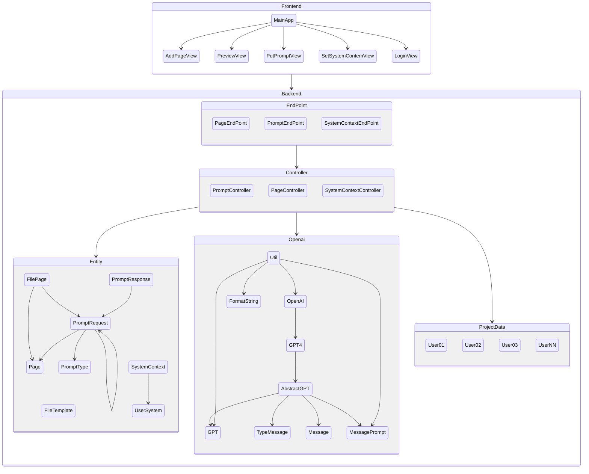
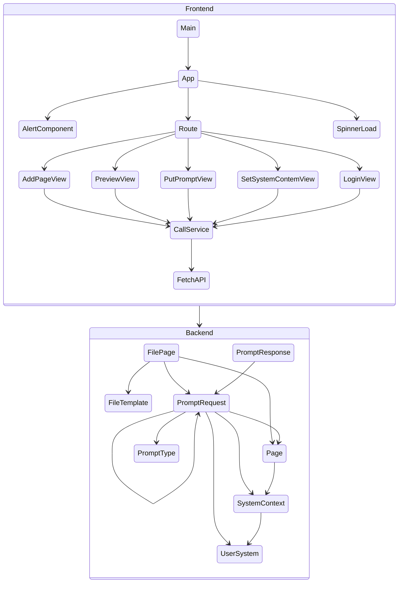
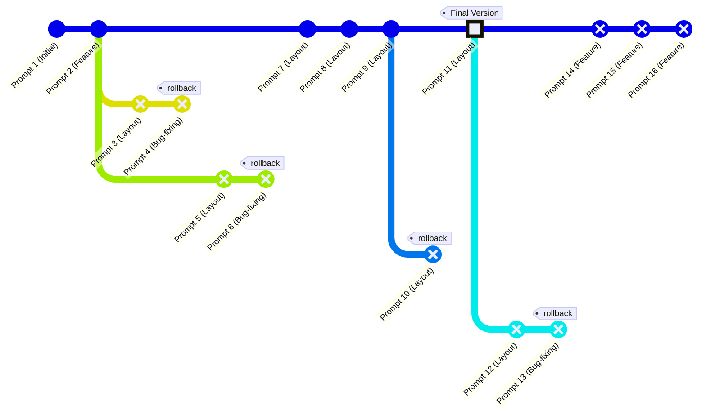

# Diagrama do Paper.

```mermaid

stateDiagram-v2

Frontend --> Backend

state Backend {

    EndPoint --> Controller
    Controller --> Entity
    Controller --> Openai
    Controller --> ProjectData

    state EndPoint {
        PageEndPoint
        PromptEndPoint
        SystemContextEndPoint
    }

    state Controller {
        PromptController
        PageController
        SystemContextController
    }

    state Entity {
        FileTemplate

        FilePage --> PromptRequest
        PromptResponse --> PromptRequest
        FilePage --> Page
        PromptRequest --> Page
        PromptRequest --> PromptType
        PromptRequest --> PromptRequest

        SystemContext --> UserSystem
    }

    state ProjectData {
        User01
        User02
        User03
        UserNN
    }

    state Openai {
        GPT
        GPT4
        AbstractGPT
        Message
        TypeMessage
        MessagePrompt
        OpenAI
        FormatString
        Util

        AbstractGPT --> GPT
        AbstractGPT --> TypeMessage
        AbstractGPT --> Message
        AbstractGPT --> MessagePrompt
        GPT4 --> AbstractGPT
        OpenAI-->GPT4
        Util --> OpenAI
        Util --> FormatString
        Util --> MessagePrompt
        Util --> GPT
    }
}

state Frontend {
    MainApp --> AddPageView
    MainApp --> PreviewView
    MainApp --> PutPromptView
    MainApp --> SetSystemContemView
    MainApp --> LoginView
}

```

```mermaid

stateDiagram-v2
    Frontend --> Backend

state Backend {

    FilePage --> FileTemplate

    FilePage --> PromptRequest
    PromptResponse --> PromptRequest
    FilePage --> Page
    PromptRequest --> Page
    PromptRequest --> PromptType
    PromptRequest --> PromptRequest
    PromptRequest --> SystemContext
    PromptRequest --> UserSystem
    Page --> SystemContext

    SystemContext --> UserSystem

}

state Frontend {
    Main --> App
    App --> AlertComponent

    App --> Route
    Route --> AddPageView
    Route --> PreviewView
    Route --> PutPromptView
    Route --> SetSystemContemView
    Route --> LoginView

    App --> SpinnerLoad

    AddPageView --> CallService
    PreviewView --> CallService
    PutPromptView --> CallService
    SetSystemContemView --> CallService
    LoginView --> CallService

    CallService --> FetchAPI
}

```

```mermaid
%%{init: { 'gitGraph': {'showBranches': false, 'showCommitLabel':true,'mainBranchName': 'Main'}} }%%
gitGraph
commit id:"Prompt 1 (Initial)"
commit id:"Prompt 2 (Feature)"
branch v1
commit id:"Prompt 3 (Layout)" type: REVERSE
commit id:"Prompt 4 (Bug-fixing)" type: REVERSE tag: "rollback"
checkout Main
branch v2
commit id:"Prompt 5 (Layout)" type: REVERSE
commit id:"Prompt 6 (Bug-fixing)" type: REVERSE tag: "rollback"
checkout Main
commit id:"Prompt 7 (Layout)"
commit id:"Prompt 8 (Layout)"
commit id:"Prompt 9 (Layout)"
branch v3
commit id:"Prompt 10 (Layout)" type: REVERSE tag: "rollback"
checkout Main
commit id:"Prompt 11 (Layout)" type: HIGHLIGHT tag: "Final Version"
branch v4
commit id:"Prompt 12 (Layout)" type: REVERSE
commit id:"Prompt 13 (Bug-fixing)" type: REVERSE tag: "rollback"
checkout Main
commit id:"Prompt 14 (Feature)" type: REVERSE
commit id:"Prompt 15 (Feature)" type: REVERSE
commit id:"Prompt 16 (Feature)" type: REVERSE

```
