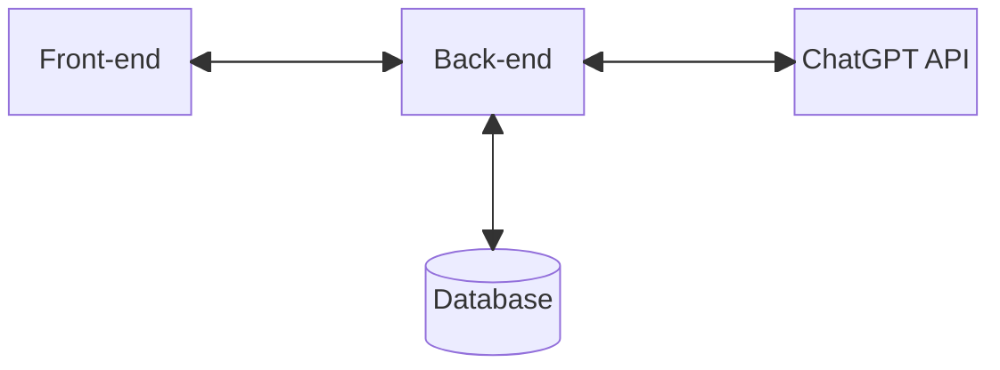

# NoCode GPT Tool

NoCodeGPT is a tool designed to help beginner developers build web applications from scratch. 

It simplifies the development process by offering an intuitive interface that automates the configuration of the environment and eliminates the need for prior knowledge of programming languages or computer logic.

## Tecnologies:

- **Front-end**:
  - Vue.js (version 3) with TypeScript using the Composition API;
  - HTML5;
  - CSS3.

- **Back-end**
  - ExpressJS;
  - SQLite 3;
  - JSON Web Token.

